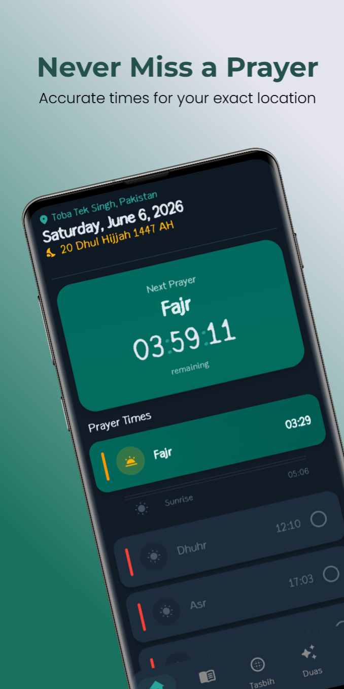
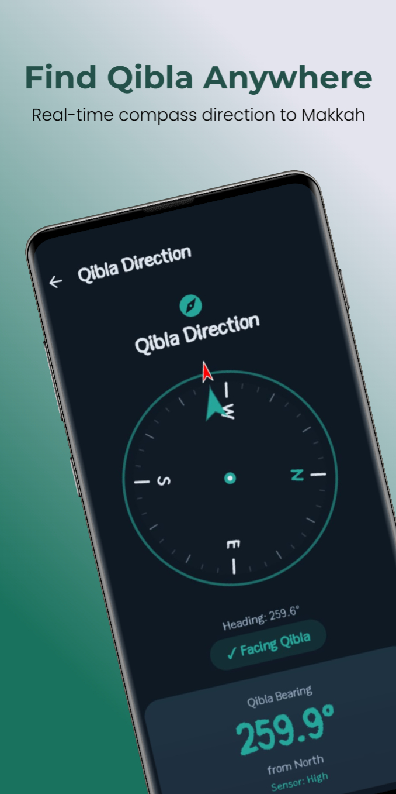
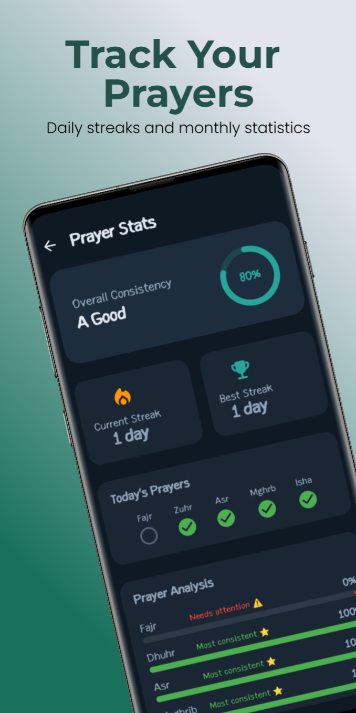
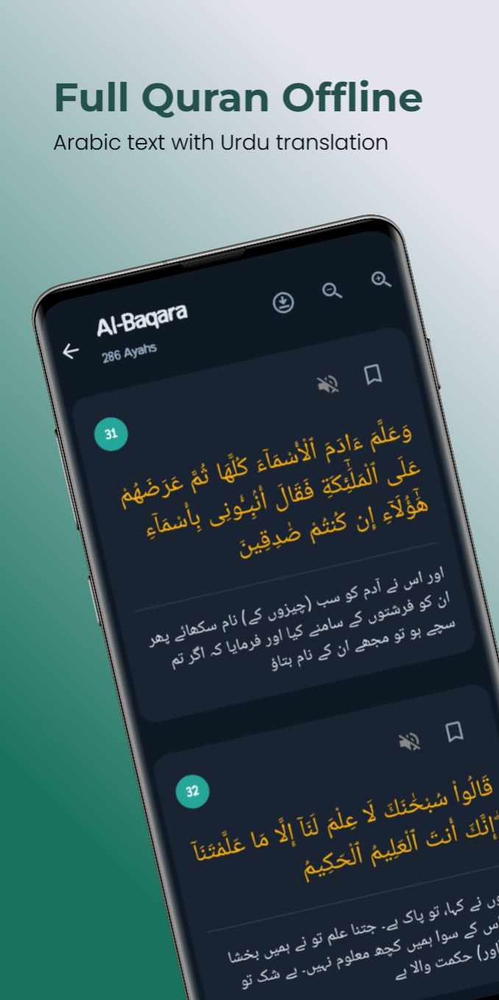
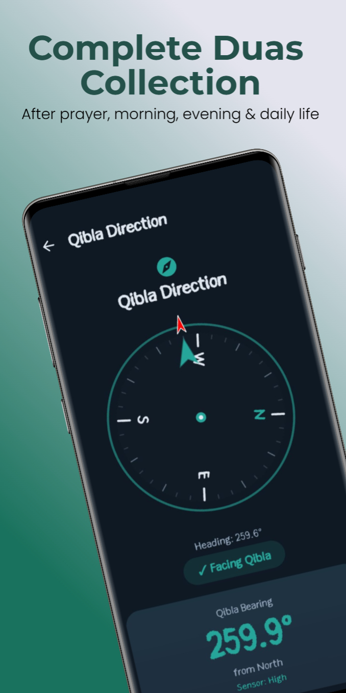
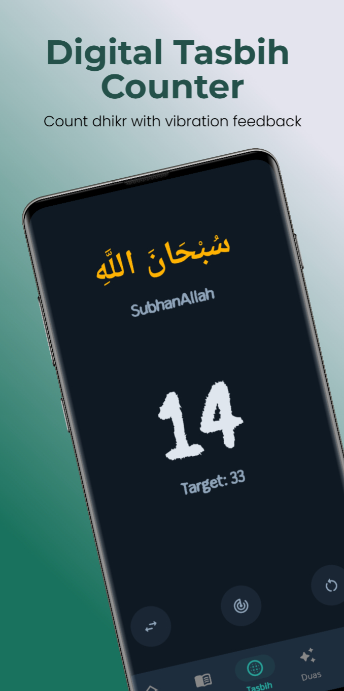
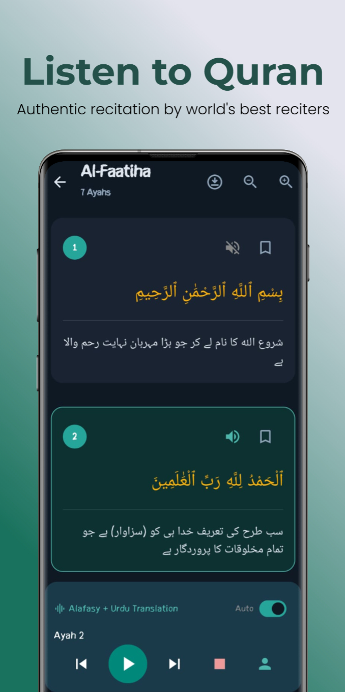

# Miqat - Your Ultimate Islamic Companion

  

Miqat is a beautiful, professional, and feature-rich Islamic app designed to assist you in your daily prayers, Quranic recitation, and dhikr. With a focus on visual elegance, fluid animations, and user privacy, Miqat provides an ad-free, distraction-free companion experience.

---

## 📥 Download the App

Get the latest stable version of Miqat directly. Tap the button below to download the official release APK:

  

*File Name:* `miqat-release.apk`  
*Current Release Version:* 1.0.0  

---

## ✨ Key Features

### 🕋 Accurate Prayer Times & Qibla Compass
* **Precision Calculations:** Get accurate prayer times based on your location. Supports multiple calculation conventions (MWL, ISNA, Egypt, Umm al-Qura, Karachi, etc.) and Madhab settings (Hanafi, Shafi'i/Maliki/Hanbali).
* **Next Prayer Countdown:** A beautifully animated dashboard shows you the current prayer time, upcoming prayer, and a real-time countdown.
* **Detailed Rakat Guides:** Tap on any prayer card to view detailed Rakat breakdown:
  * **Fajr:** 2 Sunnah (before) | 2 Fardh
  * **Dhuhr:** 4 Sunnah (before) | 4 Fardh | 2 Sunnah (after)
  * **Asr:** 4 Sunnah (before) | 4 Fardh
  * **Maghrib:** 3 Fardh | 2 Sunnah (after)
  * **Isha:** 4 Fardh | 2 Sunnah (after) | 3 Witr (Wajib)
* **Qibla Finder:** A visual compass to easily locate the direction of the Kaaba from anywhere in the world.

  
  
  

---

### 📖 The Noble Quran (Al-Quran)
* **Elegant Reading Layout:** Read the Quran with clear, scalable Indo-Pak or Uthmani Arabic script alongside English and Urdu translations.
* **Audio Recitations & Urdu Translation:** Listen to beautiful recitations by multiple renowned reciters. Enjoy the specialized **Maher Al-Muaiqly + Urdu Translation** mode, which plays Arabic verses sequentially followed by Shamshad Ali Khan's Urdu voice translation.
* **Offline Access:** Download Surahs directly to your device for offline reading and listening.
* **Bookmarks:** Save your progress and resume reading instantly.

  
  

---

### 📿 Tasbih Counter
* **Minimalist & Clean:** A beautiful interactive circle counter that lets you focus entirely on your dhikr.
* **Presets & Targets:** Easily switch between common dhikr presets (*SubhanAllah*, *Alhamdulillah*, *Allahu Akbar*) or set custom target values.
* **Haptic Feedback:** Receive subtle vibrations with every tap to easily keep count without looking at the screen.
* **Progress Tracking:** Interactive progress ring visualizing your current count towards your set goal.

  

---

### ⚙️ Customizable Settings & Theme Engine
* **Appearance & Dark Theme:** Smoothly switch between beautiful Light and Dark themes according to your preference.
* **Audio Quality Settings:** Toggle audio download quality bitrates (64 kbps, 128 kbps, 192 kbps) to optimize storage usage.
* **Notification Preferences:** Fine-tune notifications for each prayer time.
* **Clean & Direct Contact:** Get assistance or send feedback directly to the developers with one tap in the About section.

  
  

---

## 🚀 Installation Instructions

1. **Download the APK:** Tap the [Download APK](miqat-release.apk) button above, or grab the `miqat-release.apk` file from the root directory of this repository.
2. **Enable Unknown Sources:** If prompted, allow your web browser or file manager to install applications from unknown sources (this is normal for apps installed outside of Google Play Store).
3. **Install the App:** Open the downloaded APK file and follow the on-screen prompts.
4. **Set Up Location:** Grant location permissions when opening the app for the first time to get accurate local prayer times.

---

## 🔒 Privacy Focused

* **No Ads:** A clean experience with zero commercial interruptions.
* **Minimum Permissions:** Requires only location access (for prayer times calculation) and storage/internet access (to download Quran audio files for offline use).
* **Data Security:** No personal user data is collected, shared, or sent to third-party servers.

---

  Designed with care for the Muslim Ummah. May it be a source of blessing for you.

